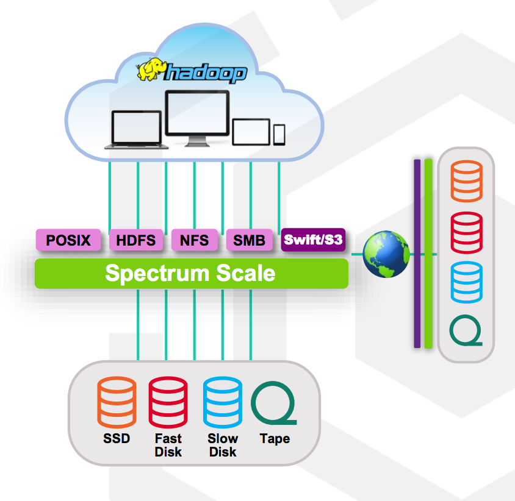
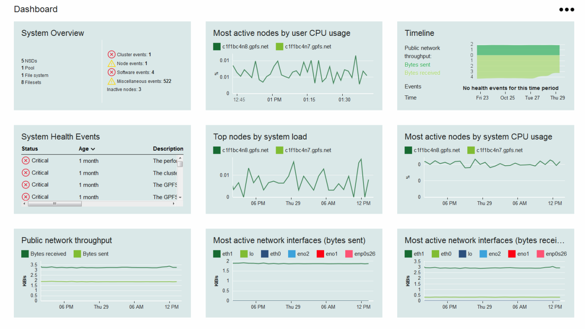
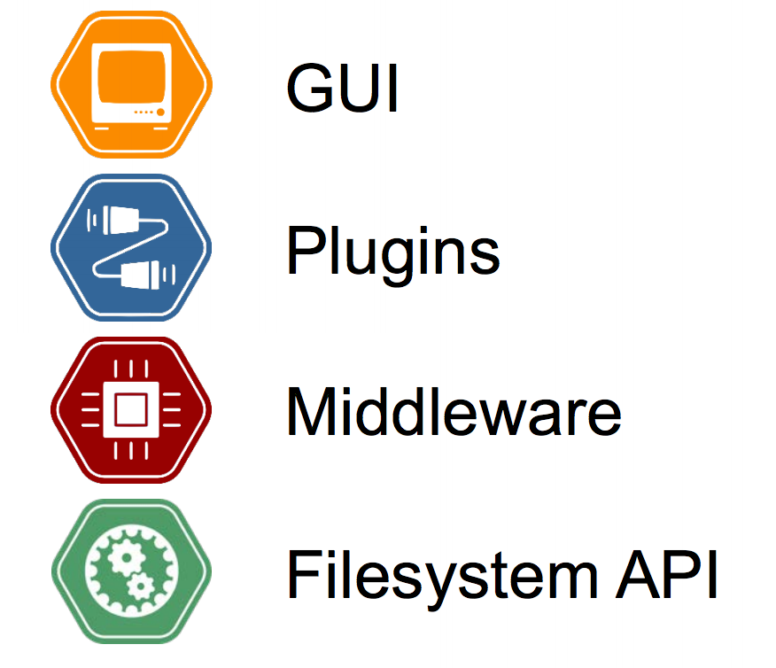
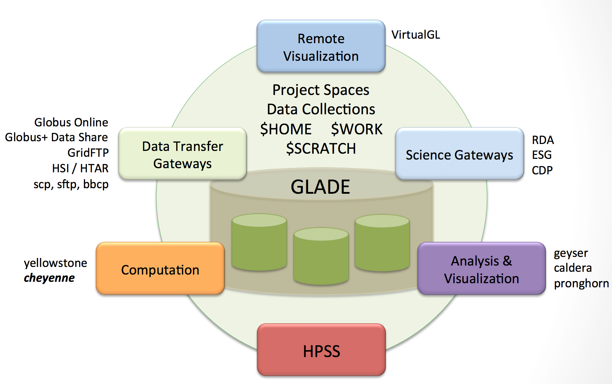
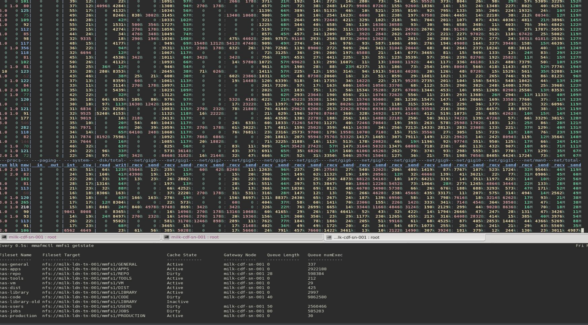
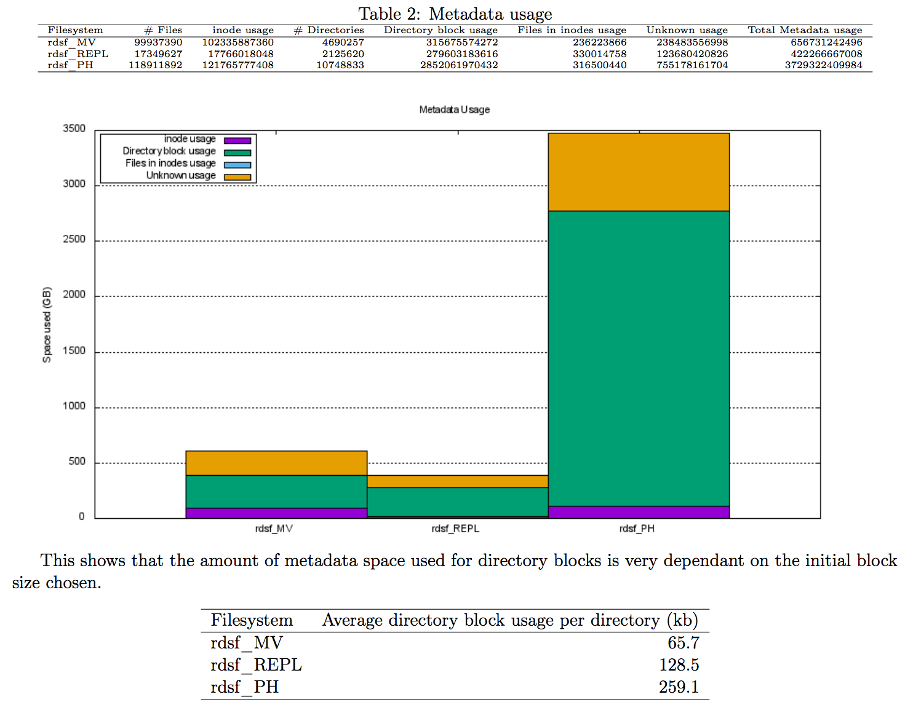
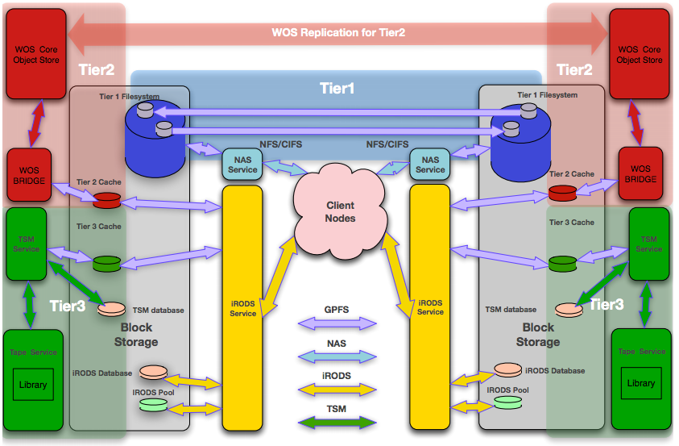
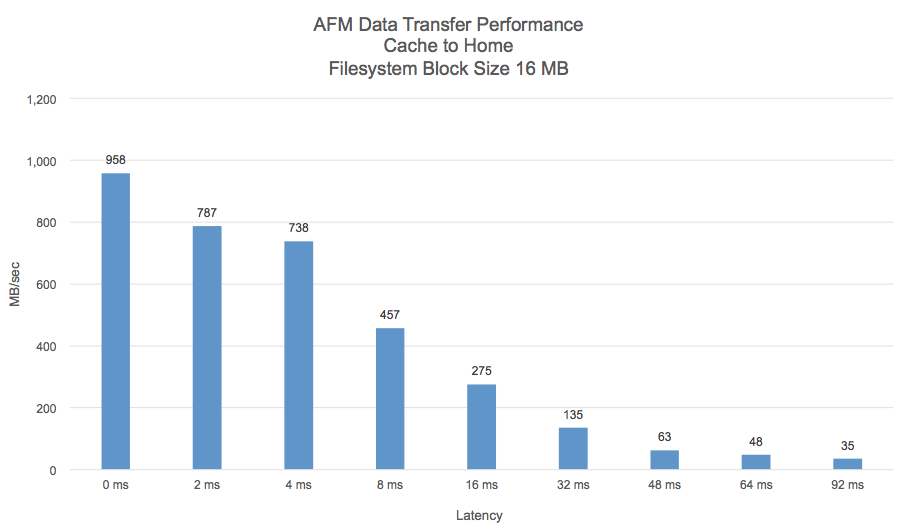
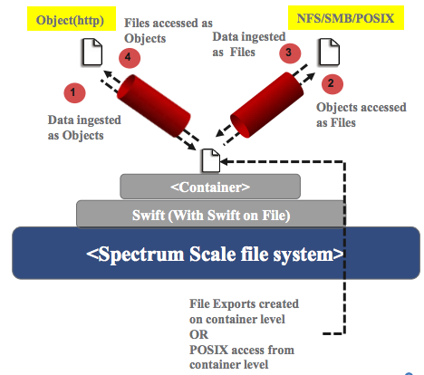

I attended my 2nd Spectrum Scale User group meeting, it was amazing to see how much feedback IBM had taken onboard from 2015 and has directly influenced the product. It was also very useful to see how other users are solving their problems using GPFS.

All the slides from the conference are [online](http://www.spectrumscale.org/presentations/), the rest of this post picks out some specific areas I found particularly interesting and how they could apply to the University of Bristol.

## Roadmap & 2016 Priorities

##### *Ulf Troppens*

[Slides](http://files.gpfsug.org/presentations/2016/south-bank/03_UlfTroppens-Spectrum_Scale_-_Spectrum_Scale_4.2_Update_and_Directions_-_Spectrum_Scale_UK_User_Group_Meeting_London_v3.pdf)

It was pointed out that Spectrum Scale is much more than just a filesystem these day. With the introduction of Cluster Export Protocols (CES), they are also focused on how to present this data out.
CES now provides the following access methods:

* SMB
* NFS
* Object
* HDFS

Some of these don't make sense to share the same set of data across protocols as the data would be presented in a meaningless way. I started to think how the RDSF would adapt to presenting non-file storage areas. Each project fileset, have different areas:

* file
* hdfs
* object

To allow projects to expose data in many different ways that are not cross compatible.

The priorities for IBM are in the following areas:

* Problem determination
* Documentation
* Security
* Defect backlog
* Improvements for Big Data
* More flexibility for GNR

IBM provide open betas of new features that can be downloaded from [here](https://www.ibm.com/developerworks/servicemanagement/tc/gpfs/evaluate.html). Currently they have the following:

* SS transparent cloud tiering
* SS object metadata search beta
* SS GUI open beta

The metadata search beta sounds very interesting and could be a starting building block for a rich metadata service within the RDSF.

Finally, it's interesting to note that there are 200 IBM staff in the Spectrum Scale team, so features are being developed fairly quickly. It drives home that we really need to keep up to date with newer versions of SS if we are going to be able to make use of these features.

## Deep Dive - 4.2 GUI & Live Demo

##### *Markus Rohwedder*

The introduction of the GUI is IBMs attempt to lower the barrier of entry to managing a Scale cluster by improving monitoring and allowing common tasks to be performed without a deep knowledge of Spectrum Scale. The monitoring side is the most interesting part to me.

When told to monitor a node, it determines what features are installed and adapts to monitor them. It collects ~440 metrics per node.

My ideal scenario would be to be able to feed metrics in to a 3rd party tool (e.g. Graphana) which would then give the flexibility to combine data from multiple different sources to give a single-pain-of-glass view of the whole estate. While I still believe this is an ideal goal, there is an overhead of setting up these metrics manually. IBM have put a lot of effort in monitoring these 440 metrics, which we would be able to deploy with minimal effort.
There was a discussion around the room about using Graphana, which seemed to have a agreement that this is a good way to go. IBM are going to work on a Graphana bridge to link these together.
There was also some discussion on if it's best to push all metrics to a central place? With the sheer number of metrics the perfmon can collect and the frequency (1 second), it might not be suitable. An alternative approach would be to pick a subset of metrics and/or a lower resolution to send to a central location for an 'overview', with the ability for an administrator to go to SS GUI when they need to 'drill down'.
It's also possible to see the raw performance data in JSON format using the `mmperfmon` command, so it should be possible to integrate with any system with a small amount of effort.

I believe the RDSF would greatly benefit from deploying the GUI as it would give us more insight in to the health of the cluster with minimal effort. As a second phase, we could then determine how best to integrate this with the rest of our monitoring suite. As this was a common request from around the room, I'm confident clear integration best practices will develop over time.

Alerts are raised on thresholds, there are a few ways of sending these out at the moment (SMTP), but they are considering how best to integrate this with other alerting tools (e.g. Nagios). The GUI makes suggestions on what action to take based on the alert. An example was an alert raised due to running out of nodes on an independent fileset, the GUI then gave the option for the administrator to increase the inodes there. While providing a simple slider interface to do this, it also allowed you to switch to a view to see the commands it ran under the hood, which gives an extra level of confidence that it's doing the correct thing.

The number of other tasks that perform modifications fairly limited via the GUI at the moments, but they are always increasing. There is a full RBAC system for granting fine grained accesses to administrators.
Charts can be customised to provide different 'dashboards' depending on the information that is most useful to an administrator.

An interesting fact from another member was that Netflix use 1/3rd of their infrastrucutre just for monitoring. It gives an insight in to how important monitoring but also how much resources are required to do it well.

## Using Spectrum Scale in the IoT World

##### *Sponsor Technical Talk (Seagate)*

##### *Ray Coetzee*

[Slides](http://files.gpfsug.org/presentations/2016/south-bank/05_SEAGATE-RayCoetzee-GPFSUG_presentation.pdf)

This talk was generally interesting in how Seagate have helped solve storage problems in both the Petroleum Exploration & Digital Surveillance areas using Spectrum Scale. There were a few "Lessons learned" that rang true in the academic world:

* I/O profiling will give you better performance improvements than brute forcing with technology. Therefore we should continue to help our researchers write more I/O efficient code when we can.
* Don't assume workloads have ever been optimized.
* Very few network engineers can find problems on the network like Spectrum Scale can. ;) It's very sensitive to packet loss.

## Python API & Demo

##### *Sponsor Technical Talk (ArcaStream)*  

##### *Jez Tucker*

[Slides](http://files.gpfsug.org/presentations/2016/south-bank/ArcaPix_GPFS_Spectrum_Scale_Python_API_final_17052016.pdf)

Arcastream provides value-add on-top of a GPFS cluster with their software stack. The base of this being the ArcaPix API

The API is very well [documented](http://arcapix.com/gpfsapi/) and have some good [examples online](https://github.com/arcapix/gpfsapi-examples).

The API provides a easy way to develop software that interfaces with GPFS, which Arcastream has committed to being stable, so they will deal with the pain of it working on all versions of Spectrum Scale.

It does some very nice lazy loading, which means it won't hit the underlying gpfs call until the data is read.

The backend code that keep the RDSF together is in dire need of an overhaul for a few reasons:
 
* It's messy enough that changes are difficult
* There is a lot of code duplication
* Code is not in a single portable "application", which will make it difficult when we need to move to a new Operating System.

The ArcaPix API could significantly lower the effort required to address these issues and enable us to develop features faster in the future.

## NCAR's Globally Accessible Data Environment

##### *User Talk:*  
##### *Pamela Gillman, NCAR*

[Slides](http://files.gpfsug.org/presentations/2016/south-bank/09_PamelaHill_NCAR_17May16.pdf)

Pam has a very interesting story about running their GLADE system, which has a very similar use case as the RDSF, but on a much larger scale (currently 16PB, expanding again in the Autumn). They have successfully integrated GLADE with many others systems:

While we both share 'project spaces' it's interesting that GLADE provides both scratch space and homedirs. The provision of scratch space to be used outside of Bluecrystal could be useful. I imagine this would complement a cluster local scratch space and not replace it.
Shared homedirs are interesting too, the quota here is comparatively low and is used for scripts/code for most GLADE users (instead of datasets). I can see the advantage here of researchers being able to develop their code on their local machine and have it easily available on the cluster. The unknown part is if homedirs are a suitable feature for UoB or if private areas within project spaces are more appropriate?

NCAR also have some interesting challenges in routing between infiband networks and ethernet networks. They are in the process of developing their own software based solution that would run on the GPFS NSD servers and be able to failover gracefully between them.

## Milk flows freely from London to Cardiff with AFM

##### *User Talk*  

##### *Dave Goodbourn, Milk Visual Effects*

[Slides](http://files.gpfsug.org/presentations/2016/south-bank/07_GPFS_UG_Presentation_MILK.pdf)

Milk are a media company based in Soho and are clients of Arcastream. Their problem is they needed to expand both their office space and render farm, but extra space and power was impossible to get in Soho. They also wanted to provide a level of DR capability. There solution was to expand to Cardiff.

They use AFM with independent-write cache at Cardiff, which means reads from Cardiff are pulled from London as requested (unless they are already cached) and then writes are pushed to London as soon as possible.
They only expose the filesets they require to be accessible from Cardiff.

It's nice to hear an AFM success story, as there have been so many horror stories with AFM. It gives me the motivation to investigate further is AFM could be a solution to spanning the RDSF between Bristol and an off-site data centre.

Milk also had a second problem they would like to solve, which was bursting their render farms to the public cloud. The challenge they had is they needed to get the data staged to the public cloud before spinning up large amounts of compute nodes.
They solved this by using AFM in independent writer cache again, but use the pre-caching feature to stage data in to the cache.

This approach could potentially be useful in staging data in to our latest cluster, BlueCrystal 4.

Milk manage to do all this across a 1Gbps link between Soho and Cardiff with a latency of 4.5 ms. They get a latency of 6.1 ms to Google cloud. Therefore these figures are similar to what we are expecting between Bristol and the JISC data centre over JANET. Although Milk currently on have 0.5PB of data to deal with.

Finally, monitoring of the state of AFM still needs some improvements: Most monitoring is done via the terminal with `dstat` and `watch mmafmctl getstate`

## Tiering to the Cloud / MC Store

##### *Technical Deep Dive*  

##### *Robert Basham*

[Slides](http://files.gpfsug.org/presentations/2016/south-bank/12_RobertBasham-Scale_Transparent_Cloud_Tiering_Users_Group_20160513.pdf)

MC Store allows you to tier data to the public cloud. This is the first released version and has some serious limitations in my opinion.

* No way of implementing a SOBAR approach
* No integration with AFM, async replication etc
* You can only tier one filesystem per cluster

It feels like there is a conflict with the features of Spectrum Protect (which can use a object storage as a pool) and also possibly Spectrum Archive. My initial reaction is that the feature set would be better integrated in to Spectrum Archive instead of a new component. It's an interesting area to keep an eye on, but too new to get seriously excited about at the moment.

## Problem Determination Enhancements

##### *Technical Deep Dive*  
##### *Mathias Dietz*

[Slides](http://files.gpfsug.org/presentations/2016/south-bank/13_MarkusDietz-ProblemDetermination_GPFSWorkshop2016-UK.pdf)

As promised at the beginning of the day, IBM have spent a lot of time trying to improve problem determination. They have broken this down in to 3 areas:

* Monitoring
* Problem Isolation
* Problem Recovery

Firstly IBM have recognised it's hard to get a clear picture of what a healthy cluster looks like. You currently have to know where to look for each component. Therefore they have introduced a new command, `mmhealth`, to give an overview

They have also added a new flexible monitoring framework which makes it easier to send metrics and alerts to other systems in an extensible way. It's decentralized model means it can scale to a large number of nodes.
It was good to hear Long waiters can be monitored using this framework from 4.2.1 as they are very useful as an early warning of the cluster grinding to a halt.

## Scale-out NAS for the masses

##### *Sponsor Technical Talk (OCF)*  

##### *Laurence Horrocks-Barlow*

[Slides](http://files.gpfsug.org/presentations/2016/south-bank/D2_P1_01_LaurenceHorrocksBarlow-ScaleoutNAS.pdf)

Laurence talks about his observations of customers NAS solutions, the problems and why he believes Spectrum Scale is the solution to much of these problems.

Lots of customers are using Spectrum Scale for HPC workloads, but still using $VENDOR appliance for home directories and corporate NAS.

The problem with using $VENDOR applicances:

* More storage required
* It's everywhere, departments doing small bits of storage everywhere.
* It's a increased cost and lower resilience / HA
* hard to scale

Requirements:

* Need "building block" storage
* Centralised storage, with centralised management
* storage as a service, sell space to your users
* Need a migration path and upgrade path
* Need to reduce cost

Range of solutions:

* Enterprise "turn key" storage solutions.
  * No flexible enough, both in authentication, tuning IO etc
  * how do you upgrade? Most of the time this has to be a direct swap with can be costly and disruptive
  * do they have an active community?

* Spectrum Scale Up & Out:
  * It's in the name, it has a history and is proven.
  * scale up with expansion shelves
  * scale out with more block
  * scale the servers
  * scale the protocols
  * scaling improves performance
  * pay for the bits you need

Overall, I agree with Laurence observations, that's why we use Spectrum Scale for the RDSF. Out of all the good points he makes, the 2 most important to be are being able to replace underlying hardware without disruption and being able to scale out different parts so we can spend out limited budget wisely.

## Metadata sizing / tuning 

##### *Indulis Bernsteins*

[Slides](http://files.gpfsug.org/presentations/2016/south-bank/D2_P2_A_spectrum_scale_metadata_dark_V2a.pdf)

Indy talks on how to best size metadata, he also mentions a lot of effort has been put in to improving the metadata documentation on the devloperworks site.

Metadata can mean different things from different users perspectives, for example:

* *Filesystem metadata* - Directory structure, access permissions, creation time, owner, etc
* *Scientists metadata* - EPIC persistent ID, data description, data source, publication ID
* *Medical patient's metadata*
* *Object metadata* - MD5 checksum, account container, etc

Metadata can be a performance bottle neck, both for system operations (e.g. Backups and Deleting snapshots) and also for more user facing operations such are searching rich metadata.
Therefore it's likely that SSD or flash would be required for the metadata storage to deliver the performance desired. With the RDSF I would already like to upgrade from 10k SAS to SSDs for metadata to increase the performance of backups. It would also allow us to do much more reporting on the state of the filesystem and help us set the direction for future improvements.
This can be a significant cost per TB, therefore it's important to understand how metadata is used, so it can be sized appropriately.

Metadata capacity is used in a number of different ways:

* *Data*: `inode` = 1 per file + indirect blocks as needed (might take up a lot of capacity)
* *Directory information*: `inode` = 1 per directory + directory blocks as needed
* *Extended Atrributes*: in data inode + EA blocks as needed

When creating a filesystem, you have to specify the maximum number of replicas (this value can never be changed) and a default number of replicas (that can be changed in the future). I've previously wondered why you wouldn't create a file system with a high number of maximum replicas but leave the default number at your current requirement to give maximum flexibility.
The reason is that when creating an block pointers in an inode, it has to create the value of maximum replicas to make sure the data structure is there ready for when the replicas of that file is increased. Therefore setting a high maximum number of replicas can significantly increase the metadata used even if you keep the default value low.

As a reminder, a NSD is sliced in to:

* Full blocks: largest contiguously allocated unit.
* Sub block: 1/32th of a block, smallest allocatable unit

Modern recommendation is to use a metadata-only NSD with a small blocksize (e.g. 128k or 256k). To both be more efficient with IO for small writes and space.
The RDSF filesystems uses dedicated metadata SSDs so we can put it on higher performing disks (10k SAS), but when the filesystems were created, GPFS did not support having a independent metadata blocksize. We are now suffering from this and would seriously benefit from a smaller metadata block size, both in terms of increasing performing on our current infrastructure and also lowering the capacity requirements (and therefore cost) on SSDs. Unfortunately, as this is a setting that can only be set as filesystem creation time, it would involve creating a new filesystem and migrating data. My biggest fear with tackling this is the impact it will have on our backup infrastructure.

`mpDIO` is a multi-process disk IO tool, Madhav may be able to provide a copy on request

Indy had developed MD sizing tool (spreadsheet) which is also available on request.

## Spectrum Protect Integration & Best Practices (advanced topic)

##### *Nils Haustein*

[Slides](http://files.gpfsug.org/presentations/2016/south-bank/D2_P3_E_IBM-NilsHaustein-SpectrumProtect_Backup_HSM_SpectrumScale.pdf)

This session quickly broke from the presentation format to an interesting discussion, which meant Nils couldn't cover all the content he intended.

There were a number of useful snippets:

* A whitepaper describing how to scale Spectrum project to multiple servers is due iin the next 2 months, which will be very useful for us at UoB.
* When a file is first backed up to a server it is bound to that servername (recorded in inode), which should make it easier to split the backup load over multiple servers but changes should always land on the correct server.
* HSM with TSM has tight integration with backups. For example, inline backup from an archived file to save the data being transferred again.
* While SOBAR is a concept rather than a technology, Spectrum Scale contains a SOBAR toolkit to help processing.
* Someone in the audience is going to raise a RFE to inline backup pre-migrated files.
* There is no technical reason why you can't point 2 GPFS clusters to one TSM server in a HSM for testing if you're VERY careful to only write from one side. This can be useful for testing that your warm standby DR cluster is ready to go.
* DMAPI has a max of 64 concurrent sessions.

## SS File Compression

[Slides](http://files.gpfsug.org/presentations/2016/south-bank/D2_P4_G_SpectrumScale-Compression-GPFSUG-South-Bank-London-17-05-2016.pdf)

Compression is introduced in 4.2 and is controller on a per file bases. Is it not live, but instead intended for archive data and integrates with the policy engine. This could be an interesting middle ground for data that hasn't been used for a while but cannot be archived to tape yet.

Typical compression ratios are between 2:1 to 5:1.

If real-time compression is required, this is not the tool, look in to Spectrum virtulize instead.

## Adventures in AFM

##### *Sponsor Technical Talk (DDN)* 
##### *Vic Cornell*

[Slides](http://files.gpfsug.org/presentations/2016/south-bank/D2_02_Vic_GPFS_Users_Group_2016.pdf)

Vic gives his insights in using AFM over NFS for Imperial College. The sites are only ~30Km apart with a network latency of ~1.3ms. Key highlights were:

* It still feels like a new feature and more of a toolkit instead of a complete solution.
* They are using it in single writer cache mode, selecting which site to be "home" on a per-fileset basis
* Hitting issues with memory limits (`afmHardMemThreshold`)

One interesting test they performed was the effect on bandwidth with increased latency. The following graph shows how a slight increase in latency can seriously effect the bandwidth AFM can use. This raises some concerns with the link between UoB and our proposed 2nd Data Centre, as the initial tests showed a high jitter rate.

## OpenStack Integration

##### *Gaurang Tapase*

[Slides](http://files.gpfsug.org/presentations/2016/south-bank/D2_03_GaurangTapase-Spectrum_Scale_User_Group_OpenStack_Integration.pdf)

All the features that Gauging Tapase presented were interesting, but of most interest to me was the Unified File and Object integration.
This allows a user to access the same data over a POSIX filesystem and over a swift object store.

This is potentially exciting as we develop tools for both UoB and external researchers to use the RDSF over the internet. We could potentially make use of a number of standard tools that provide a 'cloud' interface over the swift interface, which keeping POSIX access on-site for users who need it.

## A look into the future by IBM Research

##### *Sven Oehme*

Sven gave some insights in to possible future directions for Spectrum Scale, with the big disclaimer that nothing being discussed was a commitment to providing it.

While Sven intended to cover a lot of topics, in-depth discussion meant he only had time for 3:

There are currently over 700 parameters for tuning a spectrum scale filesystem. IBM would like to make this simpler by doing the following:

* Auto scale performance / parameters where this can be done
* Reduce the number of needed parameters to achieve desired performance.
* Auto adjust dependant parameters
* provide better insight in bottlenecks and provide hints on what to adjust

One of the biggest decisions to make when creating a filesystem is the blocksize to use as this cannot be changed once the filesystem has been created. It is very dependant on the type of workload, which makes it's extra difficult if you don't know the profile of the workload in advance or have a mixed workload.

To address this, IBM are considering removing block sizes as a user defined parameter. A Scale filesystem already has the concept of a sub-block (1/32th of a block) as the smallest single IO operation and a block is the largest single IO operation. The basic concept would involve having a very large blocksize (~16M) split in to many sub-blocks (~2048), this would allow a single filesystem to efficiently serve both small and large IO requests.

The blocksizes that are currently in use on the RDSF filesystems are a constant source of pain. Both in terms of extracting the best performance possible from the current hardware and looking forward to being efficient in capacity utilisation as more expensive hardware per TB is considered (e.g. SSD & flash).

Finally, Sven mentioned they are hoping to overhall the communication protocol to keep up with the speed of modern storage and network devices. Networks are now 20-50 times faster than reading from an SSD, therefore putting effort in to this area is worthwhile. This was an interesting number to me, which counters the argument that storage needs to be in the same room as the user.

With their testing so far, small (1k) writes have gone down from a latency of 0.2ms to 0.02ms. File removal performance has also increased by 650%.

