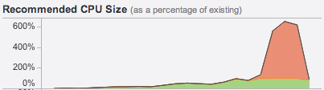
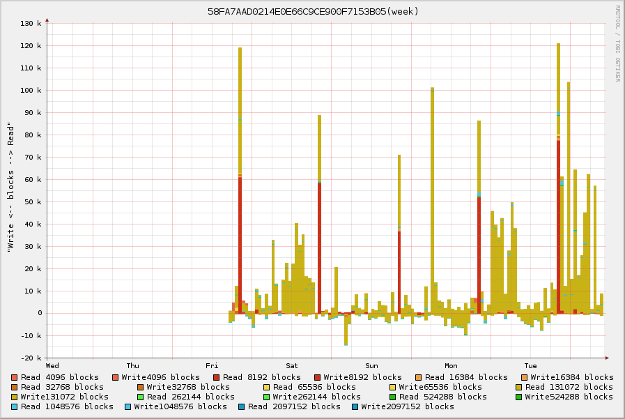
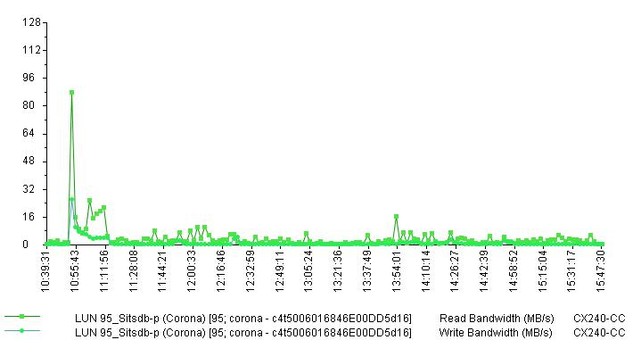
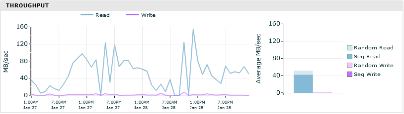
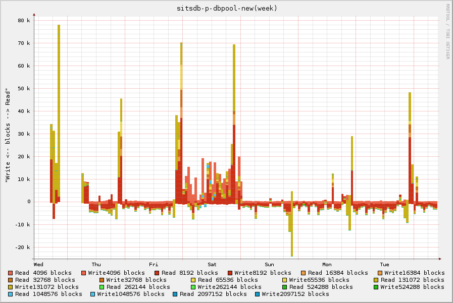
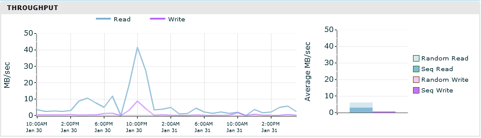

At the [University of Bristol](http://www.bristol.ac.uk), we are currently in the process of migrating from one storage vendor to another for our block storage requirements. This includes our Oracle databases running on Solaris 10.

In an attempt to minimise downtime, a number of other changes were scheduled at the same time, including moving from Fibre Channel to iSCSI and moving file system from UFS to ZFS (this should start ringing alarm bells for many of you).

Migration was going well for a number of applications until a few production Oracle databases were migrated. We got reports that the I/O was unusually slow and upon investigation we saw that the CPU usage of the storage controllers had shot up.

Working with our vendor, we were informed that a number of our LUNs had a very high sequential workload, which in turn caused the CPUs of the storage controllers to spike. This was shown by a number of symptoms.

## The Symptoms

### Sequential Workloads

Traditionally, when SANs were just a large number of spindles in a box, random I/O workloads were difficult, but sequential workloads were easy.

Our latest SAN purchase does some very clever stuff to translate a large number of random I/O operations in to a small amount of IOPS on disk. It also caches this on SSD, to speed up read operations.
To increase the efficiency of the SSD cache, it only caches random I/O and not sequential. The algorithm used is complex (and possibility private), but part of the classification is based on the size of the I/O requests.

Due to the above, sequential I/O is harder for these arrays than random I/O. Which means we need to be careful not turn random I/O in to sequential I/O at a higher layer in an attempt to help the underlying storage.

Since the workload on these LUNs were Oracle Databases, you would expect the workload to be random, but our storage was classifying it as sequential. Something clearly wasn't right, so I [hacked together](https://github.com/danfoster/io-profiler) some DTrace, Python and RRDTool to graph the size and number of I/O requests over time.  

The graph below shows shows the result of one of the LUNs in question. This is a Oracle database running on a ZFS file system with default parameters.

You can see that the yellow represents I/O requests between 65536 bytes and 13072 bytes in size. Which is large enough to trigger the underlying storage to believe it's a sequential workload.

### Throughput

As well as the type of workload we are throwing at the array, we saw a massive increase of throughput on Volumes as they were migrated. The graphs below show the throughput of the same Oracle Database. The first is on the old array using a UFS filesystem and the latter is on the new array using a ZFS filesystem.

This shows that we're asking a lot more from the new array. Previously we were spiking at 10MB/sec, now spiking at 120MB/sec.

## The Solutions

The size of I/O requests going to disk being between 65536-13072 bytes, points towards the [ZFS recordsize](https://blogs.oracle.com/roch/entry/tuning_zfs_recordsize) being set to 128k. Unlike blocksizes, ZFS recordsize is the maximum size ZFS will write when writing a file. Small files will be written as is, but large files will be written in 128k chunks.

While an Oracle database workload is going to be lots of small random I/O, the data is actually large data files on disk, which explains why ZFS is going to split write operations in the recordsize and not smaller.

This can also explain the increase in read throughput. If ZFS is writing records of 128k, It must have to read the whole 128k back if you just wants part of the data in the record.

The whitepaper by Oracle titled [Configuring Oracle Solaris ZFS for an Oracle Databases](http://www.oracle.com/technetwork/server-storage/solaris10/config-solaris-zfs-wp-167894.pdf) has to be taken with a pinch of salt, as it assumes you are using a simple SAN with whole disks as LUNs or raw disks. One good piece of advice is setting the ZFS recordsize to match the Oracle database recordsize. In most cases, this will be 8k.

ZFS recordsize can be changed on the fly for a ZFS filesystem, but it only takes effect for new files. Since a database creates a few large files, the churn is going to be too low to make a difference. Instead we created a new filesystem with the new parameters and migrated the database to it. With just the one ZFS parameter change we see the following change in both I/O operation sizes and throughput.

* I/O operations are now mainly between 4096-8192 (i.e. 8k) as shown by the red in the first graph
* The throughput on the LUN has dropped to under 10MB/sec
* Most I/O is being classified as random by the array.  

While this change has made a massive improvement, I'm hoping to be able to do some more testing with various ZFS tunables. ZFS is a great filesystem when working with raw disks, but I suspect that in our situation, the SAN knows best.
