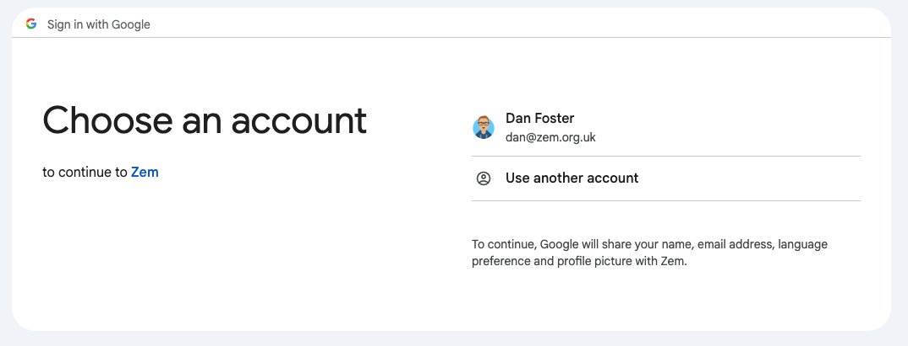

This post describes how to configure a kubernetes cluster to authenticate users via OpenID Connect. As well as configuring the kubectl client.

We'll be using [microk8s](https://microk8s.io) as the kubernetes distribution and Google as the OIDC provider.

## Configuring OIDC Provider (Google)

Before we can configure kubernetes to authenticate against an OIDC provider, we need to configure one and get the following pieces of information:

1. Issuer URL
2. Client ID
3. Client Secret  

To do this in Google, take the following steps:

1. Go to to [Google API Console](https://console.developers.google.com/apis/dashboard)
2. From the project dropdown, select the project you want to use or create a new one
3. Search for "APIs and Services"
4. If this is the first Oauth credentials you're creating under this project, slect OAuth consent screen, select internal fill in the App Information
5. Select Credentials -> Create Credentials -> OAuth Client ID
6. Select Application Type: Desktop App and give it a suitable name
7. Record the Client ID and Client Secret


## Configuring Kube API (Microk8s)

On every master node perform the following:

Edit `/var/snap/microk8s/current/args/kube-apiserver` and add:

```plaintext
--oidc-issuer-url=https://accounts.google.com
--oidc-client-id=<ADD_CLIENT_ID_HERE>
--oidc-username-claim=email
```

Restart the node using:

```bash
sudo snap restart microk8s
```

## Configuring kubectl and kubelogin

We'll use [`kubelogin`](https://github.com/int128/kubelogin).

Under the users section of `~/.kubectl/config` add the following

```yaml
users:
- name: google
  user:
    exec:
      apiVersion: client.authentication.k8s.io/v1beta1
      args:
      - oidc-login
      - get-token
      - --oidc-issuer-url=https://accounts.google.com
      - --oidc-client-id=<CLIENT_ID_HERE>
      - --oidc-client-secret=<CLIENT_SECRET_HERE>
      - --oidc-extra-scope=email
      command: kubectl
      interactiveMode: IfAvailable
      provideClusterInfo: false
```

We need to add `--oidc-extra-scope=email` as we're using that as the claim name in the previous step.

The `name` can be anything, it's just a reference to the user used in the `context` section.


## Using

Now you can use standard [RBAC](https://kubernetes.io/docs/reference/access-authn-authz/rbac/) objects to create permissions for your users.

If everything works as expected, you should be able to call a `kubectl` command and it should launch a web browser and as you to authenticate. After a successful authentication, the commmand should run.



```
[zem-c1|default] [dan:~]└2 % k get nodes
NAME     STATUS   ROLES    AGE     VERSION
node01   Ready    <none>   5d8h    v1.30.0
node02   Ready    <none>   5d23h   v1.30.0
node03   Ready    <none>   5d10h   v1.30.0
```
