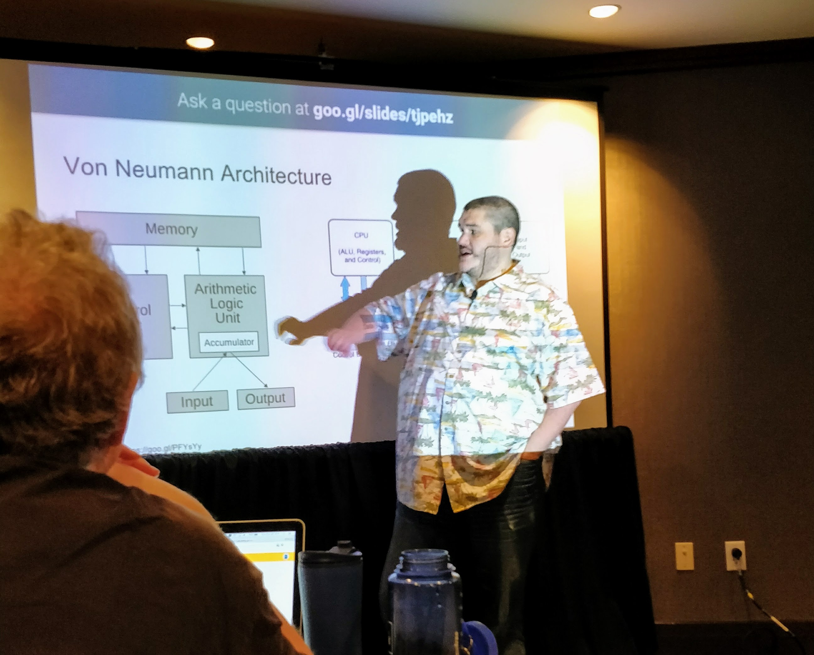
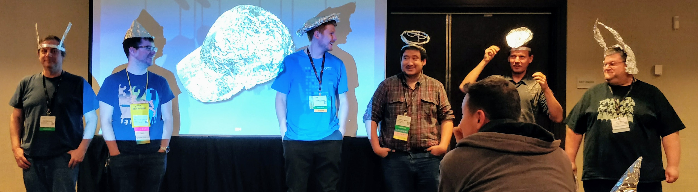

I was lucky enough to be able to attend [LISA 2017](https://www.usenix.org/conference/lisa17/) in San Francisco. As usual, this conference is absolutely fantastic and jam packed full of useful content.

Sunday to Tuesday is dedicated to the [Training Program](https://www.usenix.org/conference/lisa17/training-program). Then Wednesday sees the start of the [Conference Program](https://www.usenix.org/conference/lisa17/conference-program), that continues until Friday.

* Defending against the dark arts
* Linux performance monitoring with BPF
* Troubleshooting performance issues in postgreSQL

* Security in Automation
* UX Design and Education for effective monitoring tools
* ChatOps at Shopify: Inviting Bots in Our Day-to-Day Operations
* The 7 Deadly Sins of Documentation
* Have you tried turning it on and off again
* Linux Container Performance Analysis
* Vax to K8s: Ticketmaster's Transformation to Cloud Native Devops
* An Internet of Governments: How Policymakers Became Interested in “Cyber”
* Pintrace: A Distributed Tracing Pipeline
* Managing SSH Access without Managing SSH Keys
* Wait for Us! Evolving On-Call as Your Company Grows
* System Crash, Plane Crash: Lessons from Commercial Aviation and Other Engineering Fields
* S, M & L Logstash
* Handling the interruptive nature of Ops
* Writing and consuming REST services
* Containers at Scale with Kubernetes, Docker, and Azure

## Training

### OS Internals training

I spent the full day on Sunday attending [Caskey
Dicksons](https://twitter.com/caskey) training on "Everything an Administrator
Wanted to Know about Operating System Internals but Was Afraid to Ask". This
class crammed ~45 hours of US College level material in to 6 hours. I found the
class both interesting (in terms of the history and developments of OSes and
CPUs) and useful to understand why modern OSes work the way they do. It was also a great primer to the "Linux performance monitoring with BPF" I attended on Tuesday.

The [course](https://docs.google.com/presentation/d/18ZCIDxEQHCL1yYFckx-6u4DwNGfR-_803EQphIENpHc/edit) was broken into 6 main sections:

1. Introduction, Computer Architecture
2. Scheduling & Process Management
3. Storage Hierarchy
4. Memory Management
5. Block I/O and File System Architecture
6. Virtualization

Memory Management was the most interesting topic for me by far. For example it
was useful to understand how expensive soft page faults and hard page faults
really are. Closely followed by the scheduling topics.

I few notes that were not obvious from the [slides](https://docs.google.com/presentation/d/18ZCIDxEQHCL1yYFckx-6u4DwNGfR-_803EQphIENpHc/edit) or interesting tangents:

* [Brendan Gregg](http://www.brendangregg.com/) has ported dtrace to Linux. 2 days later, I find out that dtrace is considered old/obsolete compared to newer tracing tools.
* On Linux, a thread is a `fork()` without copying the process memory.
* "Message Passing" on slide 51 is what I know as a named pipe.
* Semaphores block process when trying to decrement below 0. Useful to purposefully blocking processes when you only want to run n. A commandline tool for reading semaphores is [`semget`](http://man7.org/linux/man-pages/man2/semget.2.html) - which should be a good starting pointer.
* When talking about "Proactively will page out unused code, gives free ram to block cache.
" in slide 98, this referring to the [`vm.swappiness`](https://en.wikipedia.org/wiki/Swappiness) kernel parameter.

### Defending against the dark arts



Branson Mathesons entertaining training on "Defending against the dark arts",
consumed the full day on Monday. The course wasn't quite what I expected, it
was more geared around thinking about the softer side of security, and didn't
touch on the technical tools as much as I expected.

Bransons stated his aim was to "Make us think more pesamstic" and he sure did that - not only because he made us all make and wear a tin foil hat.

