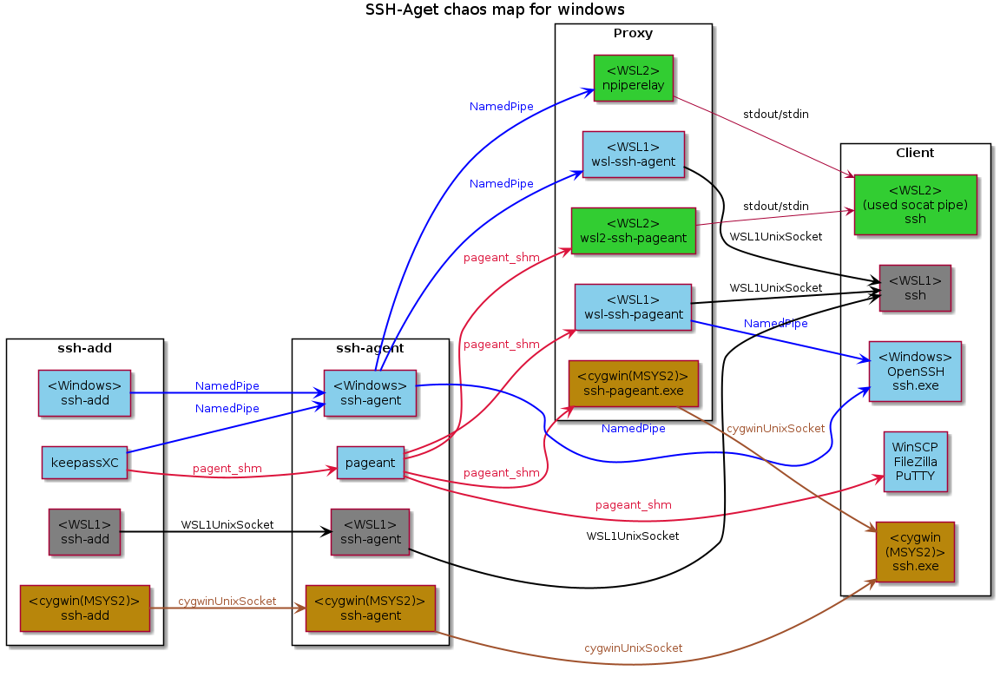

There is a lot of advice out there on the best way to share SSH credentials and SSH-agent connection between windows and WSL. This is complicated even more by the different SSH agent communication protocols on the windows side (e.g. openssh vs pagent). Frankly the situation is a bit of a mess:

([credit](https://github.com/masahide/OmniSSHAgent|OmniSSHAgent))

For me, I have the following requirements:

* Be able to access the same SSH agent from all my SSH clients, be that Windows or Linux (WSL2). So I only have to add the key once
* In WSL2 this is purely openSSH
* On the Windows side this is also only openSSH for use by vscode. I have no need to enter the ecosystem of PuTTY etc.
Previously, I have used WinCryptSSHAgent with success, but it sometimes crashed and on my most recent return to Windows 11, cannot get the WSL2 side to communicate with the agent at all.

After trying a number of solutions, I've settled on wsl2-ssh-agent, which provides access to the Windows provided openSSH ssh-agent from the WSL2 side.
