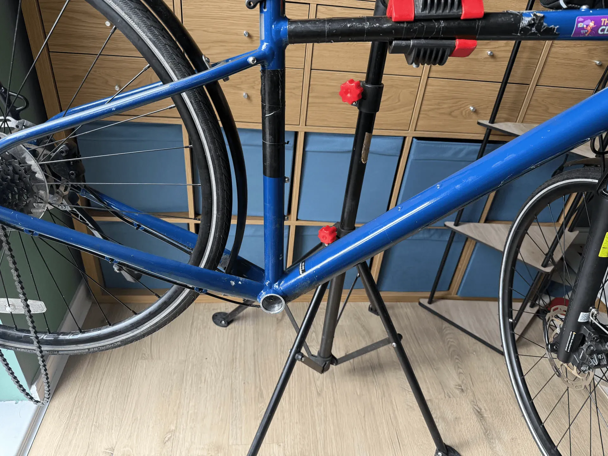
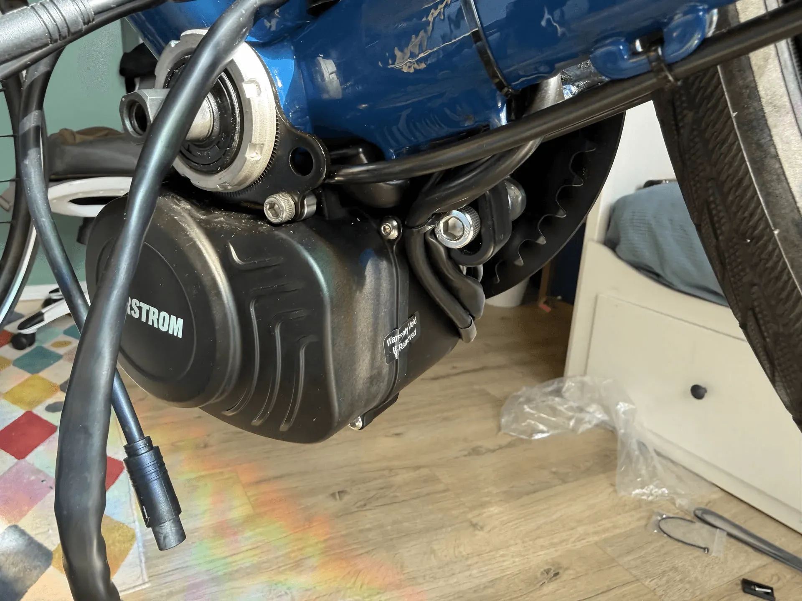
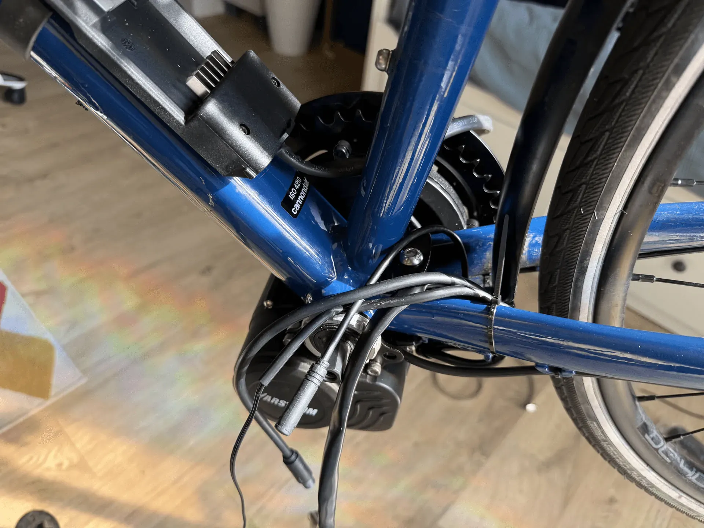
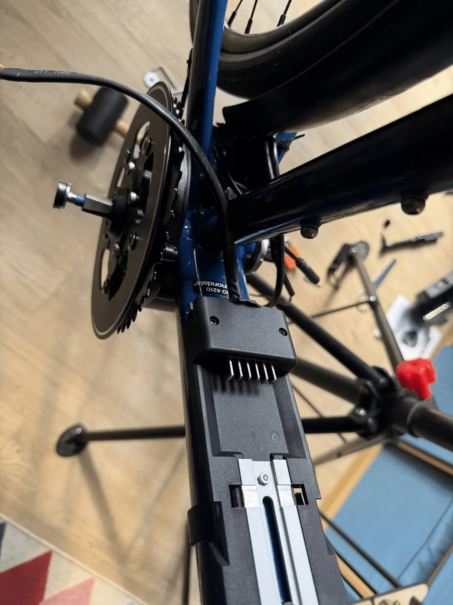
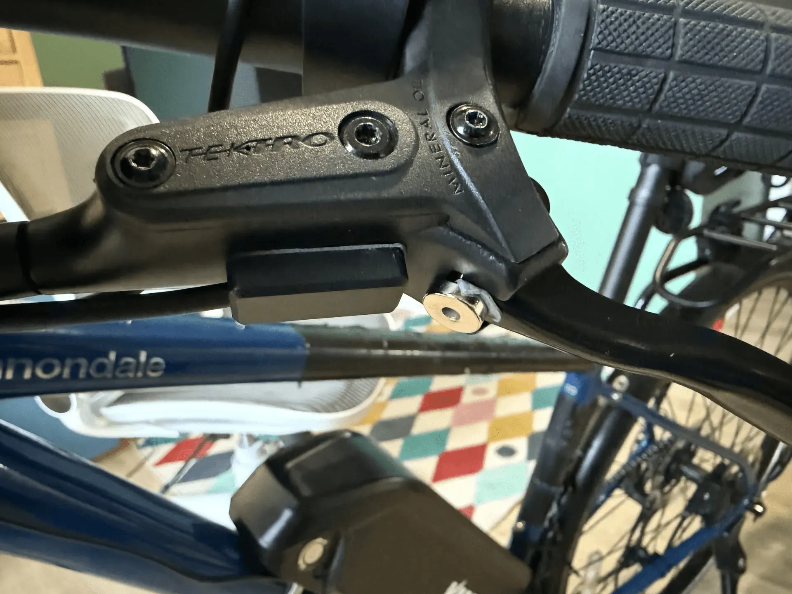
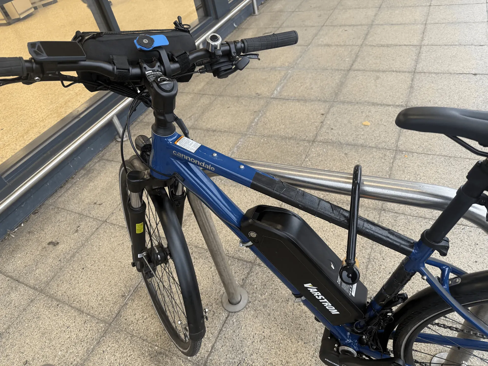
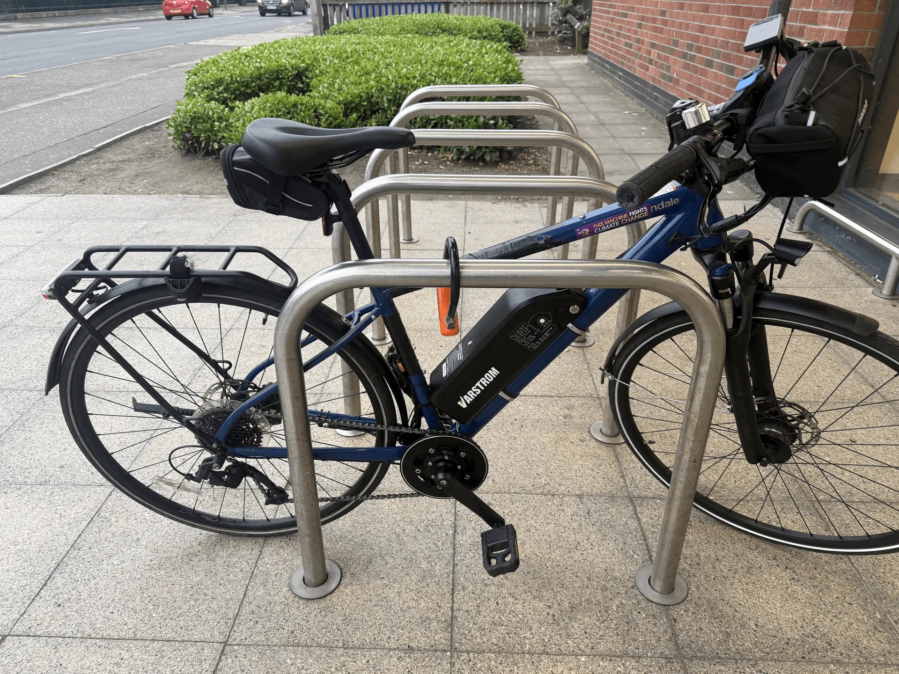

~12 months ago, my e-bike got stolen. The insurance company tried to avoid paying out, and I had an over-optimistic idea that a normal bike would force me to do more exercise, so I replaced it with a normal commuter bike; the [Cannondale Quick CQ EQ](https://www.cannondale.com/en/bikes/active/fitness/quick-cx/quick-cx-eq). I regret this decision, as in hindsight, on days I have low energy I just avoid my bike completely.

## Buy vs build

Roll on to 2026, when I decided to admit defeat and get an e-bike. The decision was now between buying a new e-bike or converting my existing bike. The factors included:

- **Cost**: A new e-bike is obviously more expensive than converting my existing bike, but there were a few factors that soften the blow:
  - I could sell my current bike, but I was unsure of the value of it in the second-hand market
  - My employer offers a cycle-to-work scheme, which would allow me to make tax-savings on the purchase of a new bike. Most schemes are fairly flexible on which suppliers you can use the scheme with. Unfortunately, my employer uses the [Evans Cycles Ride-to-Work](https://www.evanscycles.com/b2b/ride-to-work) scheme, which only allows purchases from Evans Cycles.[^evans]
- **Battery**: I live in a flat and keep my bike in a communal bike storage. I therefore need to be able to easily remove the battery to charge it. I loved my previous [Trek Allant 5+](https://www.trekbikes.com/ie/en_IE/bikes/hybrid-bikes/electric-hybrid-bikes/allant/allant-5/p/33125/) for this. But looking at Evans' selection of commuter e-bikes, the majority had "dealer removable batteries". Speaking to an Evans rep, this is the direction the industry is heading, under the guise of batteries getting stolen. Cynically, I suspect it's more due to [planned obsolescence](https://en.wikipedia.org/wiki/Planned_obsolescence). Not something that works for me and not something I want to support.
- **Finish**: A purpose-built e-bike will always have a nicer finish: inset batteries, cables routed in the frame etc. But there is a potential downside to having the shiny-looking bike: It's more appealing to thieves.
- **Hackability**: Open standards and repairability are important to me. Bosch are the most popular e-bike motor/battery provider, but also seem to be the most locked down:
  - At [Porty Community Energy](https://www.portycommunityenergy.org/), we've had water ingress to Bosch battery packs, which have killed the BMS. The cells were perfectly fine still. It's impossible to buy a new Bosch BMS on its own, forcing us to purchase a whole new battery pack at high cost and waste. Bosch also encrypt the communication between the BMS and the motor, preventing anyone making a third-party option.
  - e-bike battery chargers are focused on delivering high current to charge fast, at the cost of large size and weight. I have a desire to be able to top up my battery in the case I'm caught short. I usually have a 100W USB-C PD charger in my bag wherever I go. I would love to create a small battery charger that could be powered from USB PD that I could just keep in my bag.
- **Cool Factor**: Converting a bike would be fun!

## Choosing a conversion kit

Next was to decide what e-bike kit I wanted.

1. **Legal.** UK EAPC compliant - it sounds obvious, but it feels like there are more illegal kits out there than legal ones. My understanding is that it boils down to:
   1. The motor must be rated for maximum of 250W. It can peak above this, but the rolling average 30 min power draw must not exceed 250W.
   2. Assistance must be triggered by pedalling (i.e. not a throttle).
   3. Assistance must stop at 25 km/h
2. **Battery removable for charging, but locked to the bike when parked.** As I mentioned above, I live in a flat - it's not living next to a mains socket in a hallway. But I also don't want to have to remove it every time I park in public and carry it with me.
3. **Torque sensor, not cadence.** For the longest time, I believed mid-drive motors gave a smoother ride than hub motors. But I was recently corrected that it's actually the torque sensor that makes the difference. It's just that most hub motors use cadence sensors.
4. **Works with hydraulic disc brakes.** As that's what I have!

I ended up picking the Tongsheng TSDZ2B, with a 36V20Ah Downtube and a EKD01 display. My thought process was:

1. **Mid-drive vs Hub**: While I clarified that there shouldn't be a tight coupling between hub motors and cadence sensors, in practice it was hard to find a UK supplier of hub motors with torque sensors. Combined with mid-drive making better use of the motor power as it goes through the drivetrain, mid-drives were the winner.
2. **Tongsheng vs Bafang**: Bafang motors are popular and have good community support, but they only have cadence sensors, which is why Tongsheng won.
3. **TSDZ8 vs TSDZ2B**: The TSDZ8 is, on paper, the better motor - quieter, better cooling, better efficiency and build quality, and assist up to 120-130rpm. But the TSDZ2B has the better ecosystem: mature open-source firmware, where the TSDZ8's stock firmware is limited and the open-source project for it is still immature.
4. **Battery**: I wanted the largest capacity battery that would fit in my frame. There's a large selection out there, including wildly different cell capacities. I purposefully picked one with higher capacity cells to get more overall capacity for the same physical size.

## Installing!

### Out with the old

Until the kit arrived, I didn't really put much thought into what I would need to install it. I had heard terms like "crank puller" and "bottom bracket" in the past, but I wasn't prepared for the specialist equipment I would need: A crank puller and a bottom bracket removal tool.

I didn't want to buy these tools that I would only use once. Edinburgh is lucky enough to have the [Edinburgh Tool Library](https://edinburghtoollibrary.org.uk/), where members can borrow tools for a wide variety of projects. Even better, a friend and ETL volunteer pointed out they run a [Cycle Kitchen](https://edinburghtoollibrary.org.uk/tooligan-initiatives/tooligan-initiatives/cycle-kitchen/) every two weeks, where members can use the space and tools to work on their bike, along with some expert advice from volunteers.

I got the impression that they thought I had bitten off more than I could chew with this project, and they were partially right! Using a crank puller I was able to remove the first crank fine. Unfortunately, the drive side one was a disaster and I stripped the thread! The videos I watched warned about this, and I thought I had bottomed out the outer thread before trying to remove it, but I must have done something wrong.

After looking worried and the volunteers feeling sorry for me, they called a member of staff, Thomas, a great guy and problem solver extraordinaire. He gracefully gave us his evening to come and help me out. After some pondering, we used a combination of a [3-jaw gear puller](https://blog.enerpac.com/different-types-of-puller-and-key-features-to-consider/) and percussive force to remove it. It damaged the chainset, but this was being replaced as part of the motor install anyway.

The bottom-bracket removal was simple enough with the correct tool. It was now late and the ETL volunteers understandably wanted to go home. This was a good time to pause anyway, as I had done everything that needed specialised tools. That left me with a bike with no pedals, and even though home was slightly downhill, I decided my bike wasn't in a usable state and called Jaime to come and rescue me.

Because of the unexpected challenges, I forgot to take any photos. Here is one of my pedalless bike back at home the next day.

### In with the new

At this point it was fairly smooth sailing. Installing the motor, battery mount, speed sensor, display and brake sensors all went to plan.

The brake sensors were cool: they are hall effect sensors and you stick a magnet to the trigger.

:::gallery

:::

After some cable management and lots of zip-ties, we were ready to rock!

On its first test ride, everything seemed to work well at first. But then I noticed under high torque the chain was skipping. I was hopeful that it was just my chain was slightly stretched and not fitting well with the new chainring. I took it to my [local bike shop](https://bgcycles.co.uk/), who confirmed my diagnosis and fitted me with a new chain.

:::gallery

:::

## Next steps

Now I have a working e-bike and I'm happily using it to commute and get around Edinburgh. But the journey doesn't stop here, other things I want to do include:

### Gearing

The bike has an 11-35 cassette and originally had a 46/30 double chainring. The mid-drive kit came with a 42T chainring. I was slightly concerned this would limit my range, but was happy to take the risk and replace the cassette if it was a problem. In reality, I haven't noticed a problem. But when the cassette does need replacing, I might consider an 11-40 8-speed cassette.

### Cables

While the cables are secure, they could be neater. Ideas include:

1. Shortening the battery -> motor cable
2. 3D printing an enclosure to keep the excess cable safe

### Lights

My bike has lights powered by a front wheel dynamo, which is a terribly inefficient way of powering them. I would like to power them directly from the motor instead.

### Firmware

I would like to try out the [open-source firmware](https://github.com/emmebrusa/TSDZ2-Smart-EBike-1). The stock firmware gives "too much" assistance, even at low levels and I'm hoping I can tune this. It would also be cool to get extra metrics out of it.

[^evans]: They do have a short list of approved third-party suppliers, but in my opinion, they are carefully curated not to compete with Evans' core business (e.g. specialist bikes rather than daily commuter bikes)
